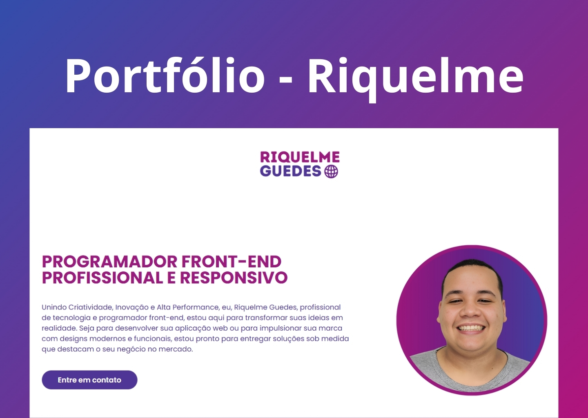

<h1 align="center"> Portfólio Riquelme Guedes </h1>

Portfólio ed Riquelme: Desenvolvimento Web e Design de interfaces

  <a href="#-tecnologias">Tecnologias</a>&nbsp;&nbsp;&nbsp;|&nbsp;&nbsp;&nbsp;
  <a href="#-projeto">Projeto</a>&nbsp;&nbsp;&nbsp;|&nbsp;&nbsp;&nbsp;

 

  

## 🚀 Tecnologias

Esse projeto foi desenvolvido com as seguintes tecnologias:

- HTML e CSS
- JavaScript
- Git e Github

## 💻 Projeto

Bem-vindo ao meu portfólio! Sou Riquelme, programador front-end especializado em HTML, CSS, JavaScript, React e TypeScript. Minha paixão é criar interfaces web dinâmicas, responsivas e de fácil interação, focando sempre em proporcionar uma experiência de usuário única. Aqui, você encontrará alguns dos meus projetos, que refletem meu compromisso com a criação de soluções digitais inovadoras e de alto desempenho, utilizando as mais recentes tecnologias para transformar ideias em realidade.

---

Feito por Riquelme Guedes"# portfolioGuedes" 
